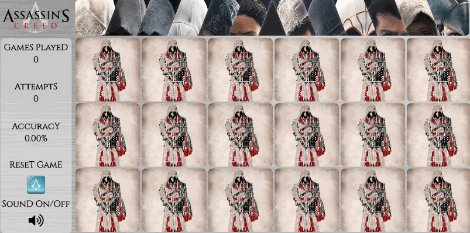

# Animus Match
* Live Demo: __https://phongtruong.com/animus-match__


<hr/>
You are a direct descendant of Ezio and have been kidnapped by Abstergo. You must sync your memories of other assassins to unlock your innate abilities and free yourself.
Animus Match is a card matching game with randomly generated cards and live stat tracking. 

## Getting Started
### Initial Setup
1. Fork this repo and clone your fork from the terminal.
```
$ git clone https://github.com/phongoli0/animus-match.git
```
2. Navigate to and open the ```/memory_match``` directory.
3. Open the ```index.html``` file and enjoy! 😃

## Contributing
Please feel free to fork this repo, make changes, submit pull requests, and send suggestions to ptruong6@outlook.com to make this app better.

## Built With
* [JavaScript](https://www.ecma-international.org/publications/standards/Ecma-262.htm)
* [jQuery](https://jquery.com/)
* HTML
* CSS

## License
[MIT License](https://opensource.org/licenses/mit-license.php)

[](https://opensource.org/licenses/mit-license.php)